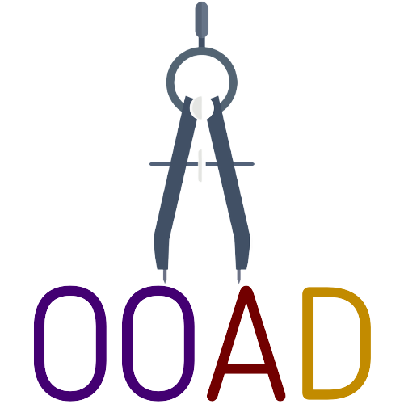

<div align="center">
  <a href=https://github.com/dimanyfantakis/ObjectOrientedArchitectureDiagrammer>
    
  </a>
  <h1>Object Oriented Architecture Diagrammer</h1>
  <p>
    A tool for the reverse engineering of Java object-oriented source code into Unified Modeling Language (UML) diagrams
  </p>

[![Contributors][contributors-shield]][contributors-url]
[![Commits][commits-shield]][commits-url]
[![Forks][forks-shield]][forks-url]
[![Stargazers][stars-shield]][stars-url]
[![Issues][issues-shield]][issues-url]
[![MIT License][license-shield]][license-url]

[**View Demo**][demo-url] · [**User Documentation**][userDocumentation-url] · [**Report Bug**][issues-url] · [**Request Feature**][issues-url]

</div>

# Table of Contents
> - [About](#about)
>   * [Motivation](#motivation)
>   * [Features](#features)
> - [Getting Started](#getting-started)
>   * [Requirements](#requirements)
>   * [Installation](#installation)
>   * [Usage](#usage)
>* [Contributing / Reporting issues](#contributing--reporting-issues)
>* [Roadmap](#roadmap)
>* [Authors](#authors)
>* [License](#license)
>* [Acknowledgments](#acknowledgments)

## About

### Motivation

The purpose of this project is to develop an independent software tool that produces UML diagrams by reverse engineering Java object-oriented source code. 

### Features

* Visualize class && package UML diagrams 
  * Choose the classes/packages that will be included in the diagram
  * Create different diagrams from the same project
* Export a diagram to:
  * GraphML in order to visualize it using yEd
  * Image
  * text file that can you can later load

## Getting Started

### Requirements

1. Clone the repository
  ```bash
  git clone https://github.com/DAINTINESS-Group/ObjectOrientedArchitectureDiagrammer.git
  ```

2. Import project into:
  * [Eclipse][importEclipse-url]
  * [Intellij IDEA][importIntellij-url]

### Installation

1. Run
  ```bash
  ./mvnw compile
  ```
to build the project.

2. 
* In Eclipse: Project -> Build
* In Intellij IDEA : Build -> Project

### Usage

1. Run
  ```bash
  ./mvnw package
  ```
to create the jar **ObjectOrientedArchitectureDiagrammer-0.0.1-SNAPSHOT-jar-with-dependencies.jar**

2. Run
  ```bash
  java -jar ObjectOrientedArchitectureDiagrammer\target\ObjectOrientedArchitectureDiagrammer-0.0.1-SNAPSHOT-jar-with-dependencies.jar
  ```
to execute the jar

Check the [User Documentation][userDocumentation-url] regarding more about the usage of the tool

### Tests

To run the tests simply run
  ```bash
  ./mvnw test
  ```

## Contributing / Reporting issues

### Code of Conduct

Any contributions you make are **greatly appreciated**.

If you want to contribute to the development of our tool, please fork the repo and create a pull request.<br>

:heavy_exclamation_mark: Please adhere to the current code style.<br>

**Don't forget to give the project a star!** :star:

1. Fork the Project.
2. Create your Feature Branch.
  ```bash
  git checkout -b feature/NewFeature
  ```
3. Commit your Changes.
  ```bash
  git commit -m 'Add some NewFeature'
  ```
4. Push to the Branch.
  ```bash
  git push origin feature/NewFeature
  ```
5. Open a Pull Request.

### Issues

Create a new [Issue][issues-url] to report any issues

## Roadmap
- [X] Fix crashes with underscores, files/folders starting with '.', etc
- [ ] Build a visualization library that supports:
    - [ ] A layout algorithm that uses bend minimization
    - [ ] Drag & drop canvas to add UML entities
    - [ ] Editable canvas in order to move & delete UML components and entities
    - [ ] Editable edges that can split when clicked to help the user avoid edge/box overlapping
- [ ] Support [PlantUML][plantuml-url]
  - [X] Use PlantUML’s language to define the diagram
  - [X] Export the image of the diagram
  - [ ] Visualize the diagram within the tool's canvas
- [ ] Deprecate jdt parser after heavy usage of javaparser, or, extend the jdt parser to support:
  - [ ] Creation of new() objects via local variables (and the resulting dependencies)
  - [ ] Enums
    
## Authors
v0.2: Dimitris Anyfantakis added a new java parser; Bill Dodis added the PlanUML extension as part of his Diploma Thesis in Univ. Ioannina.<br>
v0.1: Dimitris Anyfantakis has developed the first version of the tool as part of his Diploma Thesis in Univ. Ioannina; Panos Vassiliadis acted solely as code reviewer and co-designer.

## License

See [License][license-url] for more information regarding the license

## Acknowledgments

[contributors-shield]: https://img.shields.io/github/contributors/DAINTINESS-Group/ObjectOrientedArchitectureDiagrammer
[contributors-url]: https://github.com/DAINTINESS-Group/ObjectOrientedArchitectureDiagrammer/graphs/contributors
[commits-shield]: https://img.shields.io/github/last-commit/DAINTINESS-Group/ObjectOrientedArchitectureDiagrammer
[commits-url]: https://github.com/DAINTINESS-Group/ObjectOrientedArchitectureDiagrammer/commit/main
[forks-shield]: https://img.shields.io/github/forks/DAINTINESS-Group/ObjectOrientedArchitectureDiagrammer
[forks-url]: https://github.com/DAINTINESS-Group/ObjectOrientedArchitectureDiagrammer/network/members
[stars-shield]: https://img.shields.io/github/stars/DAINTINESS-Group/ObjectOrientedArchitectureDiagrammer
[stars-url]: https://github.com/DAINTINESS-Group/ObjectOrientedArchitectureDiagrammer/stargazers
[issues-shield]: https://img.shields.io/github/issues/DAINTINESS-Group/ObjectOrientedArchitectureDiagrammer
[issues-url]: https://github.com/DAINTINESS-Group/ObjectOrientedArchitectureDiagrammer/issues/
[license-shield]: https://img.shields.io/github/license/DAINTINESS-Group/ObjectOrientedArchitectureDiagrammer
[license-url]: https://github.com/DAINTINESS-Group/ObjectOrientedArchitectureDiagrammer/blob/main/LICENSE
[userDocumentation-url]: https://drive.google.com/file/d/17h9-hPtQ7GXwKxacQCjEKP51aE3G2JdZ/view?usp=sharing
[demo-url]: https://github.com/DAINTINESS-Group/ObjectOrientedArchitectureDiagrammer
[importEclipse-url]: https://www.baeldung.com/maven-import-eclipse
[importIntellij-url]: https://www.jetbrains.com/idea/guide/tutorials/working-with-maven/importing-a-project/
[plantuml-url]: https://plantuml.com/